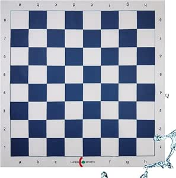

# Questões da Tarefa 01: exercícios do livro _Eloquent Javascript_

Exercícios presentes em [_Eloquent Javascript_::Program Structure](https://eloquentjavascript.net/02_program_structure.html).

## 1. Criando um triângulo (retângulo) no Terminal
_Write a loop that makes seven calls to console.log to output the following triangle:_
```bash
#
##
###
####
#####
######
#######
```
_It may be useful to know that you can find the length of a string by writing .length after it_

```javascript
let str = "abc";
console.log(str.length);
// → 3
```

## 2. FizzBuzz

_Write a program that uses console.log to print all the numbers from 1 to 100, with two exceptions. For numbers divisible by 3, print "Fizz" instead of the number, and for numbers divisible by 5 (and not 3), print "Buzz" instead._

_When you have that working, modify your program to print "FizzBuzz" for numbers that are divisible by both 3 and 5 (and still print "Fizz" or "Buzz" for numbers divisible by only one of those)._

## 3. Chessboard

_Write a program that creates a string that represents an 8×8 grid, using newline characters to separate lines. At each position of the grid there is either a space or a "#" character. The characters should form a chessboard._

_Passing this string to console.log should show something like this:_

```bash
 # # # #
# # # # 
 # # # #
# # # # 
 # # # #
# # # # 
 # # # #
# # # #
```

Este tabuleiro deve se assemelhar ao tabuleiro de xadrez que pode ser visto na figura a seguir:


Fonte: [Internet](https://m.media-amazon.com/images/I/61WgsN1yHML._AC_SY450_.jpg)

_When you have a program that generates this pattern, define a binding size = 8 and change the program so that it works for any size, outputting a grid of the given width and height._

> **OBSERVAÇÃO:** 
> Usaremos como caractere de nova linha "\n"
